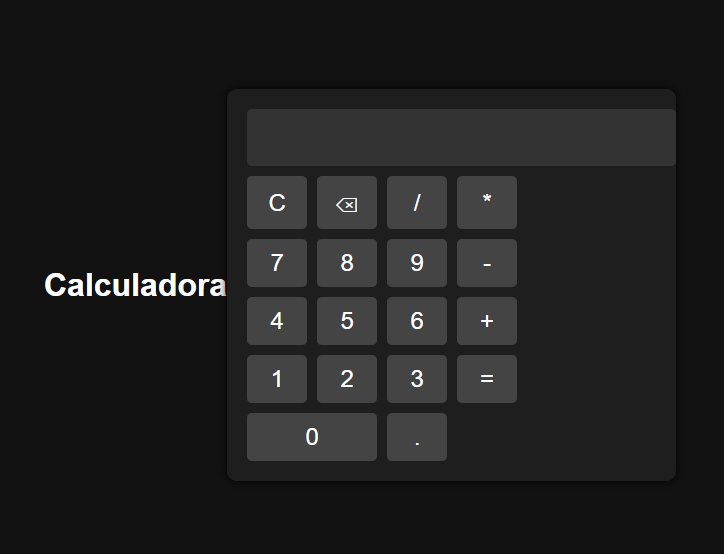

# 🧮 Calculadora Web
Una sencilla pero elegante calculadora hecha con HTML, CSS y JavaScript. Cuenta con una interfaz moderna con soporte para operaciones básicas como suma, resta, multiplicación, división, y manejo de decimales.

---

## 🌐 Vista Previa del proyecto Calculadora

 <!-- Puedes cambiar o eliminar esta línea si no tienes una imagen de vista previa -->

---

## 📁 Estructura del Proyecto
text
Proyecto2.1/           ← Carpeta 
│
├── README.md          ← Documentación general del proyecto
├── index.html         ← Estructura de la calculadora
├── estilos.css        ← Estilos visuales, colores, modo oscuro
└── script.js          ← Funciones y lógica de los botones

---

## 📋 Características

- Interfaz amigable y responsiva.
- Estilo moderno con modo oscuro.
- Operaciones básicas:
  - Suma (+)
  - Resta (-)
  - Multiplicación (*)
  - División (/)
- Botón de limpiar (C) y borrar (⌫).
- Soporte para números decimales.

---

## 🛠 Tecnologías utilizadas
- HTML5
- CSS3
- JavaScript

---
